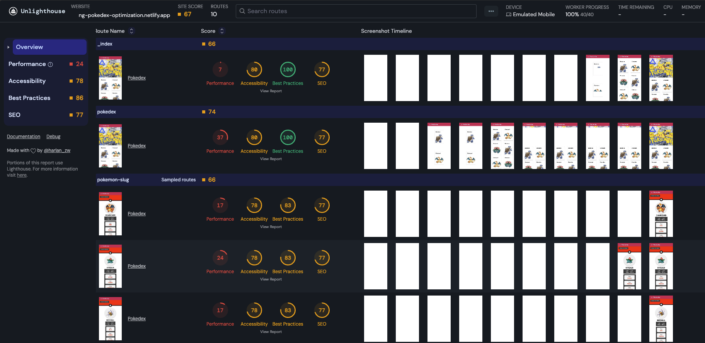
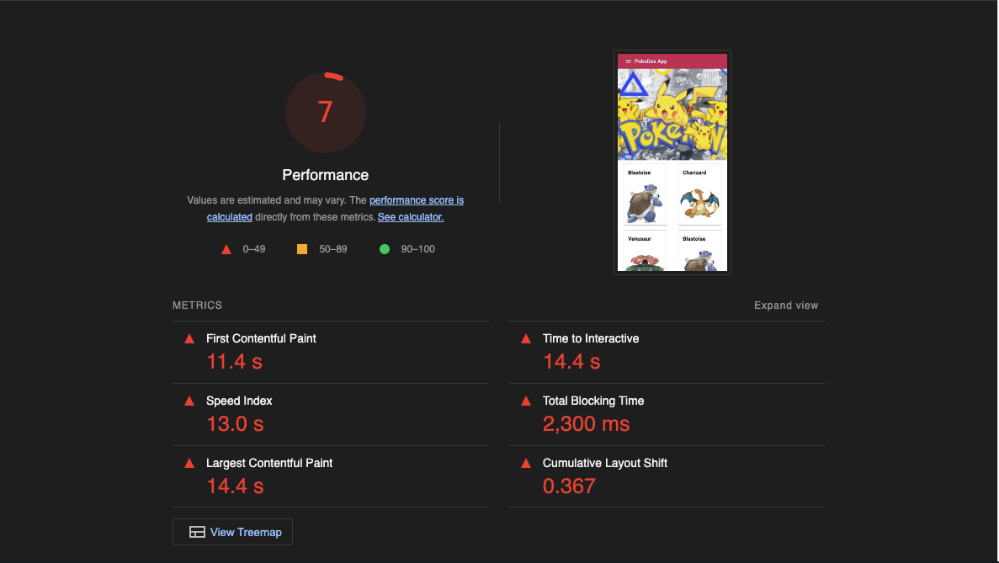
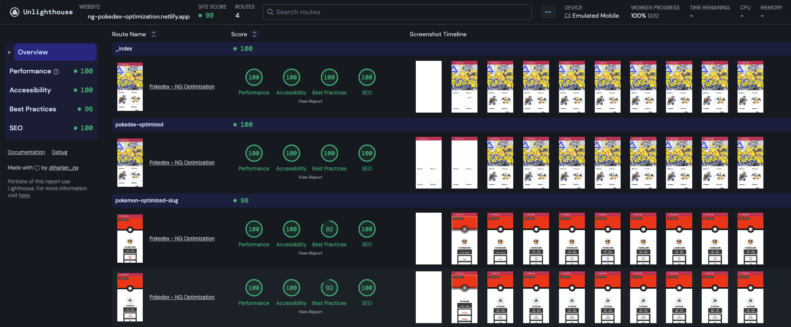
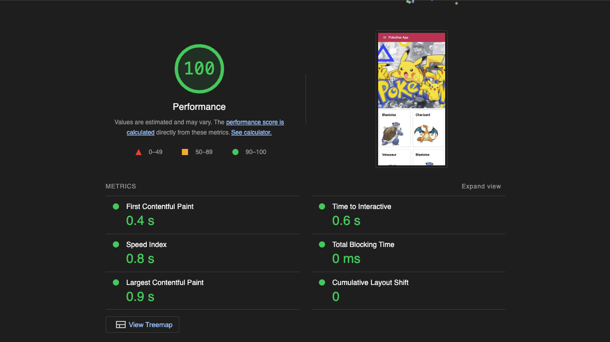

# Angular Optimization with Pokemon

This is a basic Angular app, featuring a pokedex to showcase some performance optimisation techniques within Angular SPAs.
This project was generated with the [Angular CLI](https://github.com/angular/angular-cli).

If you want to find out more about the optimization techniques we followed, please make sure to check out the related article:
[Supercharging Angular apps for better performance](https://medium.com/zeal-tech-blog/supercharging-angular-apps-for-better-performance-6814e46bb3c0)

## Update to version 19

The project utilises Angular version 19 and most of its latest features. If you want to review the changes so as to utilise the latest features in your project too, here is the related PR: [Update project to Angular v19](https://github.com/dimeloper/angular-optimization/pull/9).

## Performance measurements

The idea is the following, we start with a couple of pages that are far from optimized, and we take some initial measurements using [unlighthouse](https://unlighthouse.dev/)* for faster feedback loops.
Then we are going to optimize our pages, while we are aiming for a better Core Web Vitals performance and better lighthouse scores overall.

Before optimization - Overview:


Before optimization - Main page Web Vitals scores:


After optimization - Overview:


After optimization - Main page Web Vitals scores:


If you want to run your checks yourself you can either go to https://ng-pokedex-optimization.netlify.app/ and use your Chrome's lighthouse (make sure to use an incognito window),
or you can download unlighthouse and run the full audit while using the related scripts.

Install unlighthouse:

```
npm install -g unlighthouse
```

Audit the bad performing pages (before optimization).

```
pnpm audit:bad-pages
```

Audit the optimized pages (after optimization).

```
pnpm audit:optimized-pages
```

*Unlighthouse is a tool that is able to scan our entire site with Google Lighthouse in a few minutes. Open source, fully configurable with minimal setup.

## Development documentation

[DEVELOPER.md](DEVELOPER.md)

## Recommended Web Vitals blog post

[Navigating the Waters of Core Web Vitals in 2024](https://medium.com/@dimeloper/navigating-the-waters-of-core-web-vitals-in-2024-3cd6a08666d9)

## Stay in touch

- LinkedIn: [Dimitris Kiriakakis](https://linkedin.com/in/kiriakakis)
- Instagram: [@dimeloper_](https://instagram.com/dimeloper_)
- Twitter: [@dimeloper](https://twitter.com/dimeloper)
